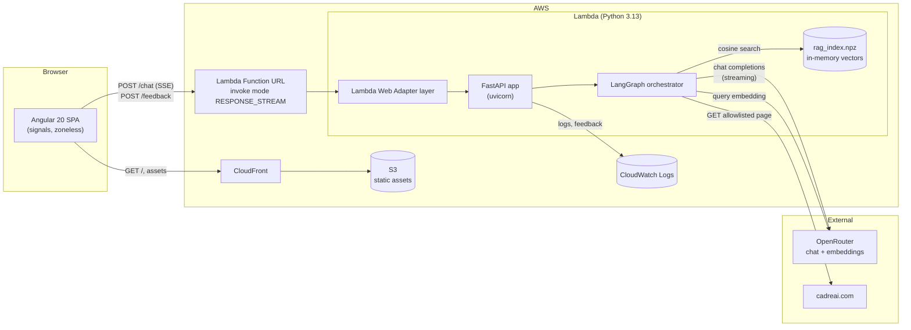
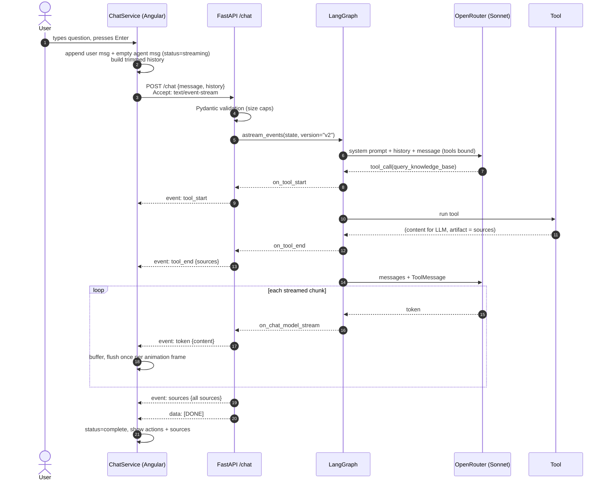

# Cadre AI Chatbot — Technical Documentation

A customer-support chatbot for Cadre AI. An Angular single-page app streams
answers from a Python agent running on AWS Lambda. The agent is a LangGraph
loop around one LLM (Claude Sonnet via OpenRouter) with three tools: semantic
search over Cadre's PDF corpus, a fetcher for an allowlisted set of Cadre
website pages, and a templated hand-off to the human team.

## Reading order

| Document | What it covers |
|---|---|
| [README.md](README.md) | This page: system overview, request lifecycle, repository map |
| [api_contract.md](api_contract.md) | HTTP endpoints, request/response schemas, the SSE event vocabulary |
| [lambda_backend.md](lambda_backend.md) | FastAPI app, Lambda entry points, configuration, dependencies, error handling, tests |
| [agents.md](agents.md) | LangGraph graph, state, routing, tools, RAG pipeline, models, prompts |
| [web_ui.md](web_ui.md) | Angular app structure, streaming client, rendering, state, styling, tests |
| [security.md](security.md) | Threat model and every security control, front and back |
| [deployment.md](deployment.md) | AWS resources, packaging, environment, CloudFront, operations |
| [decisions.md](decisions.md) | Architecture decisions, trade-offs, known limitations, future work |

---

## System overview



| Layer | Technology | Where it lives |
|---|---|---|
| Frontend | Angular 20 standalone components, signals, zoneless change detection, custom SCSS, `marked`, Lucide icons | `WebUI/` |
| Hosting | S3 + CloudFront | AWS |
| API | FastAPI + `StreamingResponse` (Server-Sent Events) | `LambdaBackend/app.py` |
| Runtime | AWS Lambda, Python 3.13, Lambda Web Adapter for response streaming | `LambdaBackend/run.sh` |
| Agent | LangGraph `StateGraph` with a `ToolNode` | `LambdaBackend/orchestrator/` |
| LLM | `anthropic/claude-sonnet-4-6` through OpenRouter's OpenAI-compatible API | configured in `config.py` |
| Retrieval | Offline-built numpy index + hosted embeddings (`openai/text-embedding-3-small`) | `LambdaBackend/rag/` |
| Persistence | None. Conversation state lives in the browser; feedback goes to CloudWatch | — |

---

## Request lifecycle

One chat turn, end to end:



Things that can change this flow:

- **Escalation.** If the model calls `escalate_to_human`, or the loop reaches
  `MAX_ITERATIONS` with a tool call still pending, the graph routes to the
  `escalate` node. That node writes a templated message without calling the
  LLM. `app.py` streams that text as `token` events.
- **Errors.** Any exception inside the stream becomes `event: error` followed
  by `[DONE]`. The HTTP status is always 200 once streaming has started.
- **User stop.** The client aborts the `fetch`. Any partial text becomes a
  complete answer. If no text had arrived yet, the turn becomes a retryable
  error.

---

## Repository map

```
CA_ClientChatbot/
├── CLAUDE.md                  Claude Code project context
├── docs/                      ← you are here
├── plan-lambdabackend.md      Original backend plan (historical; see decisions.md for deviations)
├── plan_webui.md              Original frontend plan (historical)
├── LambdaBackend/
│   ├── app.py                 FastAPI routes + SSE translation layer
│   ├── handler.py             Mangum adapter (buffered fallback entry point)
│   ├── run.sh                 Entry point under the Lambda Web Adapter (streaming)
│   ├── config.py              All environment variables, resolved once
│   ├── system_prompts.md      Source of truth for every prompt (parsed at runtime)
│   ├── orchestrator/          LangGraph graph, state, nodes, prompts parser, tools/
│   ├── rag/                   PDF loader, embedders, vector index
│   ├── scripts/               build_index.py, package.sh
│   ├── documents/             Source PDFs (git-ignored)
│   └── tests/                 121 pytest tests, no network
└── WebUI/
    ├── src/app/core/          ChatService, SSE decoder, FeedbackService, markdown pipe
    ├── src/app/features/chat/ Chat page, components, models
    ├── src/styles/            Design tokens, typography, globals
    ├── tools/mock-server.mjs  Backend mock implementing the same contract
    └── proxy.conf.json        Dev proxy: /chat, /feedback → localhost:8000
```

## Quick start (local)

```bash
# Backend
cd LambdaBackend
python -m venv .venv && source .venv/bin/activate
pip install -r requirements-dev.txt
cp .env.example .env                 # set OPENROUTER_API_KEY
python scripts/build_index.py        # after placing PDFs in documents/
uvicorn app:app --reload --port 8000

# Frontend (second terminal)
cd WebUI
npm ci
npx ng serve                         # http://localhost:4200, proxied to :8000
```
