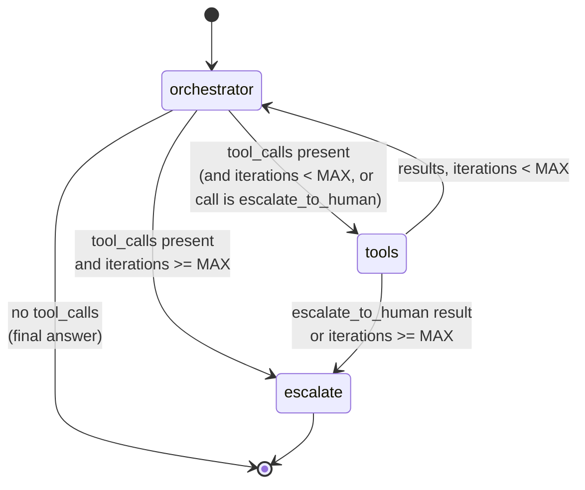
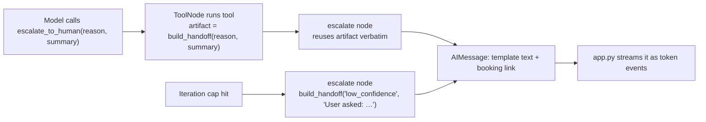

# Agents

The agent is one LangGraph loop in which a single LLM decides, turn by turn,
whether to answer or call one of three tools. It lives in
`LambdaBackend/orchestrator/` (graph, nodes, tools) and `LambdaBackend/rag/`
(retrieval). Every prompt the model sees comes from
`LambdaBackend/system_prompts.md`.

---

## 1. Models

| Role | Model | Provider / access | Where configured |
|---|---|---|---|
| Orchestrator (reasoning, tool choice, answer) | `anthropic/claude-sonnet-4-6` | OpenRouter, OpenAI-compatible chat completions via `langchain_openai.ChatOpenAI` | `MODEL_NAME` |
| Query + corpus embeddings | `openai/text-embedding-3-small` (1536-dim) | OpenRouter `/embeddings` via `HostedEmbedder` | `EMBEDDING_MODEL`, `EMBEDDINGS_BASE_URL` |
| Offline / test embeddings (optional) | any sentence-transformers model, e.g. `all-MiniLM-L6-v2` | local, `LocalEmbedder` | `EMBEDDING_BACKEND=local` |

LLM client settings (`orchestrator/nodes.py::get_llm`):

| Parameter | Value | Reason |
|---|---|---|
| `temperature` | `0.2` | Factual support answers; small variation in wording |
| `timeout` | `30 s` | Keeps a hung upstream inside the Lambda timeout |
| `max_retries` | `1` | One retry for transient errors without doubling latency |
| `streaming` | `True` | Needed for `on_chat_model_stream` token events |
| tools | `bind_tools(TOOLS)` | Tool JSON schemas sent with every call |

The model only ever sees one system prompt: the orchestrator prompt. There
are no sub-agents and no router model.

---

## 2. Graph



Built in `orchestrator/graph.py`:

```python
builder = StateGraph(AgentState)
builder.add_node("orchestrator", orchestrator)
builder.add_node("tools", ToolNode(TOOLS, handle_tool_errors=True))
builder.add_node("escalate", escalate)
builder.set_entry_point("orchestrator")
builder.add_conditional_edges("orchestrator", route_after_orchestrator, {...})
builder.add_conditional_edges("tools", route_after_tools, {...})
builder.add_edge("escalate", END)
```

The graph compiles once per container (`@lru_cache get_graph()`). It has no
checkpointer, so conversation memory is the `history` array the client sends
with each request.

### State (`orchestrator/state.py`)

```python
class AgentState(TypedDict, total=False):
    messages: Annotated[list[AnyMessage], add_messages]   # appended, never replaced
    iterations: int                                       # +1 per orchestrator pass
    escalation_reason: str | None                         # set by the escalate node
```

### Nodes (`orchestrator/nodes.py`)

| Node | What it does | LLM call? |
|---|---|---|
| `orchestrator` | Prepends `SystemMessage(orchestrator_system_prompt())` to `state.messages`, `ainvoke`s the tool-bound model, appends the reply, increments `iterations` | Yes |
| `tools` | LangGraph's prebuilt `ToolNode`: runs every tool call in the last `AIMessage`, possibly in parallel, and appends one `ToolMessage` per call | No |
| `escalate` | Builds the hand-off text **from a template**: `"{message}\n\n{booking_link}"`, sets `escalation_reason` | **No** |

### Routing rules

`route_after_orchestrator` looks at the **newest `AIMessage`**, not
`messages[-1]`:

1. No `AIMessage` → `END`.
2. No tool calls → `END`. A final answer always wins, even on the last
   iteration.
3. Any call is `escalate_to_human` → `tools`. The tool runs so that the
   templated text comes from one code path.
4. `iterations >= MAX_ITERATIONS` → `escalate`, with no further LLM call.
5. Otherwise → `tools`.

`route_after_tools` looks at the trailing run of `ToolMessage`s, which covers
parallel calls:

1. Any result from `escalate_to_human` → `escalate`.
2. `iterations >= MAX_ITERATIONS` → `escalate`.
3. Otherwise → `orchestrator`.

With the default `MAX_ITERATIONS=3`, a turn makes at most **3 LLM calls**.

### Escalation paths



Both paths call `build_handoff()`, so the text is identical byte for byte. An
unknown reason code is normalised to `low_confidence`.

---

## 3. Tools

All three tools use `@tool(..., response_format="content_and_artifact")`. The
**content** string is what the LLM reads. The **artifact** carries structured
citations on the `ToolMessage` to the SSE `tool_end` event, so the UI gets
sources without the model spending context on JSON. Each tool description is
the fenced block under `### \`<tool>\`` in `system_prompts.md`.

### 3.1 `query_knowledge_base(query: str, top_k: int = 0)`

`orchestrator/tools/rag.py`

| Aspect | Behaviour |
|---|---|
| Purpose | Semantic search over Cadre's PDF corpus (case studies, articles) |
| `top_k` | `0` or negative → `RAG_TOP_K` (3) |
| Resources | Index and embedder load lazily on first call, then stay in module globals |
| Content (for LLM) | `[n] <file> p.<page> (score 0.xx)\n<chunk>` per hit. Scores are included so the model can judge confidence |
| Artifact | `[{type: "document", label: "<file> · p.<page>", excerpt: <chunk>}]` |
| Nothing above threshold | "No chunks scored above the 0.35 relevance threshold … does not cover it." |
| Any failure | "The knowledge base is unavailable (…). Try scrape_cadre_website instead, or escalate." |

### 3.2 `scrape_cadre_website(page: PageName)`

`orchestrator/tools/scraper.py`

| Aspect | Behaviour |
|---|---|
| Purpose | Live content from cadreai.com when the KB has no answer or may be out of date |
| Input | `page` is a `Literal` of **37 fixed identifiers** (`home`, `about`, `strategy`, `industries/real-estate`, …). The model cannot supply a URL |
| URL | `CADRE_WEBSITE_URL + PAGE_PATHS[page]` |
| HTTP | `httpx.AsyncClient(timeout=30, follow_redirects=True)`, `User-Agent: CadreAI-Chatbot/1.0` |
| Cleaning | BeautifulSoup `html.parser`; removes `script, style, nav, footer, header, noscript, svg, form`; collapses whitespace; truncates to `SCRAPE_MAX_CHARS` (4000) |
| Title | `<title>` → first `<h1>` → URL |
| Cache | In-process dict `page → (expires_at, text, title)`, TTL `SCRAPE_CACHE_TTL` (3600 s), monotonic clock, per container. Failures are not cached |
| Artifact | `[{type: "url", label: <title>, url: <url>}]` |
| Failures | HTTP status, network errors, parse errors and empty pages come back as text telling the model to escalate rather than retry |

`test_every_page_identifier_is_offered_to_the_model` checks that the allowlist
and the page list in `system_prompts.md` match.

### 3.3 `escalate_to_human(reason: Reason, conversation_summary: str)`

`orchestrator/tools/escalation.py`

| Aspect | Behaviour |
|---|---|
| Purpose | Hand off to the human team; no external calls |
| `reason` | `Literal["pricing", "existing_client", "custom_scope", "user_requested", "low_confidence"]` |
| Content | "Escalation prepared (reason: …). Reply with this message and the booking link verbatim: …" |
| Artifact | `{reason, booking_link, message, summary}`, consumed by the `escalate` node, not by the UI |
| Messages | Taken from the `## Escalation Message Templates` table in `system_prompts.md` |

| Reason | When the prompt tells the model to use it |
|---|---|
| `pricing` | Cost, rates, contracts |
| `existing_client` | Active engagement or account issues |
| `custom_scope` | Discovery or scoping requests |
| `user_requested` | Explicit request for a person |
| `low_confidence` | No confident answer after using the tools (also the cap fallback) |

---

## 4. Retrieval (RAG) pipeline

There is no vector database. The corpus is embedded **offline**, saved as a
compressed numpy archive, shipped inside the Lambda zip and searched in memory
with one matrix-vector product.

```mermaid
flowchart LR
    subgraph Offline["Offline — scripts/build_index.py"]
        P[/"documents/*.pdf"/] --> L["loader.load_documents<br/>pypdf, page by page"]
        L --> C["split_text<br/>500 chars, 50 overlap,<br/>word boundaries"]
        C --> EB["embedder.encode<br/>batches of 96"]
        EB --> N1["L2-normalise"]
        N1 --> Z[("rag_index.npz<br/>vectors + JSON meta")]
    end
    subgraph Runtime["Runtime — per query"]
        Q["query string"] --> EQ["HostedEmbedder.encode<br/>1 HTTP call"]
        EQ --> N2["L2-normalise"]
        Z -.np.load once.-> M["vectors (N×d float32)"]
        N2 --> DOT["scores = vectors @ q"]
        M --> DOT
        DOT --> K["argpartition top_k<br/>→ sort → filter ≥ RAG_MIN_SCORE"]
        K --> H["SearchHit[]"]
    end
```

### 4.1 Chunking (`rag/loader.py`)

- PDF text is extracted per page, so each chunk carries a page number for
  citation.
- Whitespace is normalised, then text is split into windows of at most
  `CHUNK_SIZE` characters on **word boundaries**. A token longer than one
  window is hard-split.
- Overlap is built by walking back from the window end while the carried text
  fits in `CHUNK_OVERLAP` characters. It is bounded so that each window always
  advances, which prevents an infinite loop.
- Files are processed in sorted filename order, so the index is stable from
  one build to the next.
- `Chunk = {text, source (filename), page (1-based), chunk_index}`.

### 4.2 Embedding (`rag/embedder.py`)

Both backends implement one protocol: `async encode(texts) -> np.ndarray` of
L2-normalised float32 rows.

| Backend | Use | Notes |
|---|---|---|
| `HostedEmbedder` | Production queries and the default build | `POST {base}/embeddings`, batches of 96, sorts results by `index` (providers need not preserve order), checks the response count |
| `LocalEmbedder` | Offline builds, tests | Lazily imports sentence-transformers. Not in the Lambda package |

Safety checks run when the embedder is constructed. It rejects a missing key,
the `...` placeholder from `.env.example`, and an `sk-or-` OpenRouter key
pointed at a non-OpenRouter URL. HTTP errors are turned into actionable
messages (401/403 key, 404 base URL, 429 rate limit).

### 4.3 Index (`rag/index.py`)

| Aspect | Detail |
|---|---|
| Format | `np.savez_compressed(vectors=float32[N,d], meta=str(JSON))`. `meta = {format_version: 1, model_name, chunks}` |
| Load | `np.load(..., allow_pickle=False)`: metadata is a JSON string, so no pickle is ever deserialised |
| Integrity checks | Format version, **model name must equal `EMBEDDING_MODEL`**, vector count must equal chunk count, query dimension must equal index dimension |
| Search | `scores = vectors @ q` (vectors are unit-length, so this is cosine similarity); `argpartition` for top-k; sort; drop hits below `min_score` |
| Complexity | O(N·d) per query. For thousands of chunks this takes microseconds; the embedding HTTP call dominates latency |

The model-name check matters because vectors from different embedding models
are not comparable. Without it, a mismatch would produce plausible-looking but
meaningless scores.

### 4.4 Tuning

| Knob | Default | Guidance |
|---|---|---|
| `RAG_MIN_SCORE` | `0.35` | Model-specific. Calibrate by listing real scores with `min_score=0` and setting the floor between the last relevant hit and the first irrelevant one. **Also update the number quoted in `system_prompts.md`** |
| `RAG_TOP_K` | `3` | The model may pass a larger `top_k` per call |
| `CHUNK_SIZE` / `CHUNK_OVERLAP` | `500` / `50` | Changing either requires rebuilding the index |

---

## 5. Prompts (`system_prompts.md` → `orchestrator/prompts.py`)

`system_prompts.md` is the single source of truth. The code **parses** it and
never restates a prompt.

| Section in the markdown | Parsed by | Used as |
|---|---|---|
| `## Orchestrator System Prompt`, first fenced block | `orchestrator_system_prompt()` | System message on every orchestrator call |
| `### \`query_knowledge_base\`` etc., first fenced block | `tool_description(tool)` | `description=` of each `@tool` |
| `## Escalation Message Templates` table | `escalation_templates()` | Hand-off text per reason code |

Placeholders are substituted from configuration, so each URL is set in one
place only:

| Placeholder | Variable |
|---|---|
| `{booking_link}` | `BOOKING_LINK` |
| `{website_url}` | `CADRE_WEBSITE_URL` |
| `{portal_login_url}` | `PORTAL_LOGIN_URL` |
| `{maturity_index_url}` | `MATURITY_INDEX_URL` |

The parser is strict on purpose. A missing heading, a missing fence or an
escalation table without all five reason codes raises `PromptError` at import
time, so the function fails to start rather than running with an empty
prompt.

### Orchestrator prompt structure

1. **Identity**: Cadre AI support assistant; direct, professional.
2. **About Cadre AI**: services, industries and partners, so it can answer
   without a tool call.
3. **Cadre portal**: when to share the sign-in and AI Maturity Index links
   (the model cannot read behind them).
4. **Knowledge base contents**: a summary of the 12 case studies and 27
   articles, so the model knows when a KB call is worthwhile.
5. **Tools, in order of preference**: when to call each and when not to;
   query-writing guidance (problem + industry + solution keywords, one query
   per sub-question).
6. **Answer rules**: never fabricate client names, pricing or statistics;
   ground answers in tool results; keep them concise; do not mention tools.
7. **Escalation behaviour**: frame the hand-off positively and always include
   the booking link.

---

## 6. Worked examples

| User asks | Expected path | LLM calls |
|---|---|---|
| "Hi!" | orchestrator → END | 1 |
| "Have you done anything for mortgage lenders?" | orchestrator → `query_knowledge_base` → orchestrator → END | 2 |
| "What events are coming up?" | orchestrator → KB (no hits) → orchestrator → `scrape_cadre_website("events")` → orchestrator → END | 3 |
| "How much does an engagement cost?" | orchestrator → `escalate_to_human("pricing")` → escalate → END | 1 |
| Question the tools can't answer | orchestrator → KB → orchestrator → scrape → orchestrator wants another tool → cap → escalate (`low_confidence`) | 3 |

---

## 7. Known limitations

- **No conversation memory on the server.** The client resends up to 20
  turns each time, so the input tokens for a turn grow with conversation
  length.
- **The prompt hardcodes the 0.35 threshold.** It is not substituted from
  `RAG_MIN_SCORE`, so the two can drift apart.
- **The scraper cache is per container.** Concurrent Lambda instances each
  fetch and cache separately.
- **No reranking or hybrid search.** Retrieval is pure dense cosine over
  fixed-size chunks.
- **No evaluation harness in CI.** The six brief scenarios exist as a Claude
  Code command (`/test-scenarios`), not as automated regression tests
  against the live model.
- **Prompt injection through tool output.** Retrieved and scraped text
  reaches the model as trusted-looking context. See [security.md](security.md#4-llm-and-agent-security).
