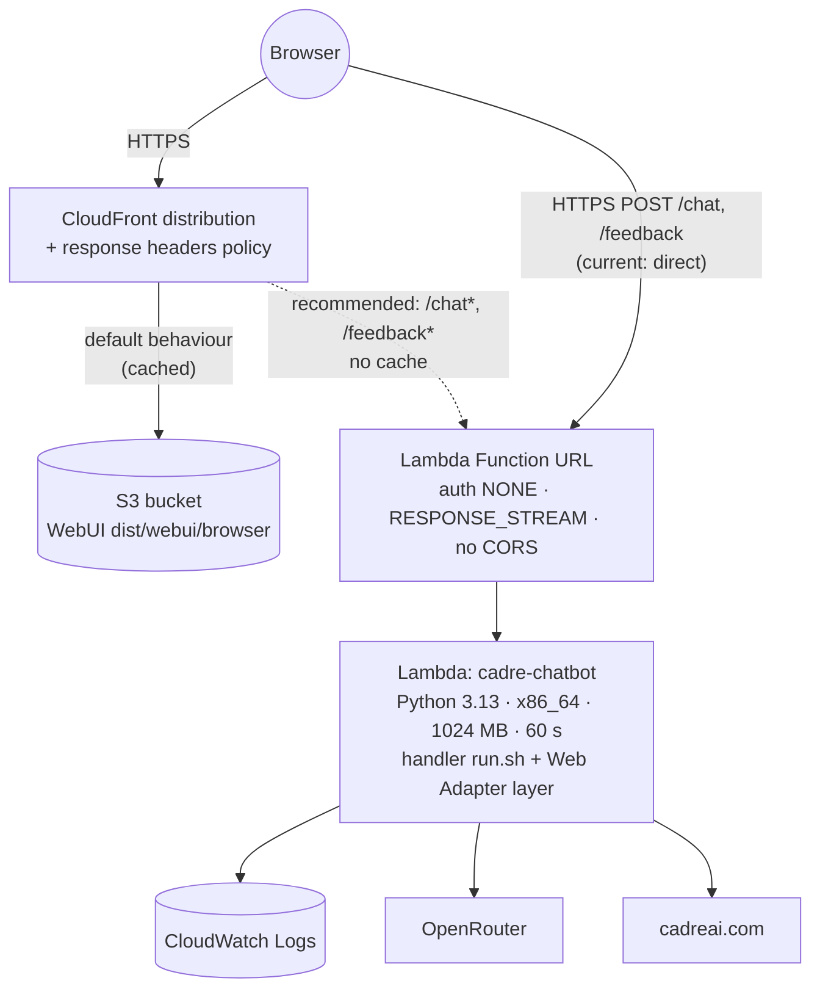
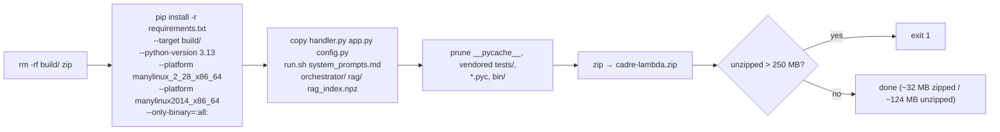
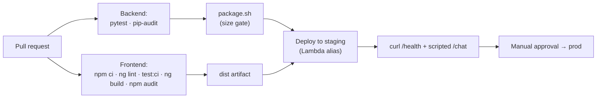

# Deployment and Operations

How to build, deploy, configure and operate the system on AWS.

---

## 1. Target topology



In the **current** setup, the SPA calls the Function URL directly
(`environment.prod.ts` and the CSP `connect-src`), so CORS is involved. The
**recommended** setup routes the API through the same CloudFront distribution
as well. That gives the browser a single origin and makes WAF enforceable
(see [security.md §7](security.md#7-open-risks-and-recommended-hardening)).

---

## 2. Backend

### 2.1 Build the RAG index (whenever the PDFs change)

```bash
cd LambdaBackend
# PDFs in documents/  (git-ignored)
python scripts/build_index.py
# → Checking hosted:openai/text-embedding-3-small ... ok — 1536 dimensions
# → Chunked N PDF(s) into M chunks.
# → Wrote rag_index.npz — M vectors x 1536 dims (X MB).
```

The script first sends one throwaway embedding request as a preflight, so a
bad key, URL or model fails within about a second. Always build with the
`hosted` backend for deployment; a `local` index cannot be queried inside the
zip.

### 2.2 Package

```bash
./scripts/package.sh                          # python3.13, x86_64 (default)
PY_VERSION=3.12 ARCH=aarch64 ./scripts/package.sh
```



- Wheels are resolved for **Lambda's** interpreter and glibc, not the local
  machine's. A wheel built locally can import fine on your machine and then
  fail in Lambda with an ELF error.
- Two manylinux tags are passed because packages publish different ones.
  AL2023's glibc 2.34 supports both.
- If `rag_index.npz` is missing, the script prints a warning. The function
  still works, but the KB tool reports itself unavailable and the agent falls
  back to scraping.

### 2.3 Lambda function configuration

| Setting | Value |
|---|---|
| Runtime | Python 3.13 |
| Architecture | x86_64 (must match `ARCH` used in packaging) |
| Memory | 1024 MB |
| Timeout | 60 s |
| Handler | `run.sh` (streaming) — or `handler.handler` for buffered fallback |
| Layer | `arn:aws:lambda:<region>:753240598075:layer:LambdaAdapterLayerX86:<version>` (`LambdaAdapterLayerArm64` for arm64). **Use the function's own region**; current version on the [aws-lambda-web-adapter releases page](https://github.com/awslabs/aws-lambda-web-adapter/releases) |
| Execution role | `AWSLambdaBasicExecutionRole` only |
| Reserved concurrency | Recommended (e.g. 10–20) as a cost ceiling |

Environment variables: every variable listed in
[lambda_backend.md §5](lambda_backend.md#5-configuration-configpy), plus the
following for streaming mode:

| Variable | Value |
|---|---|
| `AWS_LAMBDA_EXEC_WRAPPER` | `/opt/bootstrap` |
| `AWS_LWA_INVOKE_MODE` | `response_stream` |
| `PORT` | `8080` |
| `CORS_ALLOW_ORIGIN` | The production site origin (not `*`) |

### 2.4 Function URL

| Setting | Value |
|---|---|
| Auth type | `NONE` (or `AWS_IAM` behind CloudFront OAC — recommended) |
| Invoke mode | `RESPONSE_STREAM` |
| CORS | **Off.** FastAPI owns CORS; duplicated headers break browsers |

### 2.5 Verify

```bash
curl -s "$FUNCTION_URL/health"                      # {"status":"ok"}
curl -N -X POST "$FUNCTION_URL/chat" \
  -H 'content-type: application/json' \
  -d '{"message":"What does Cadre AI do?","history":[]}'
```

| Symptom | Likely cause |
|---|---|
| All tokens arrive at once at the end | Buffered path: layer missing, handler not `run.sh`, env vars missing, or invoke mode `BUFFERED` |
| Browser: "Failed to fetch", curl works | CORS: origin not in `CORS_ALLOW_ORIGIN`, or CORS also enabled on the Function URL |
| `error` event immediately | `OPENROUTER_API_KEY` missing — check logs for `RuntimeError` |
| Function fails to start, `PromptError` | `system_prompts.md` missing from the zip or a heading/fence was edited |
| Agent never cites documents | `rag_index.npz` missing, or `EMBEDDING_MODEL` ≠ model in the index (see WARNING log) |
| Stream cut off mid-answer | Lambda timeout (60 s) reached |

---

## 3. Frontend

### 3.1 Configure

1. `WebUI/src/environments/environment.prod.ts` → `apiUrl` = Function URL
   (or `''` if CloudFront routes `/chat` to Lambda on the same origin).
2. `WebUI/src/index.html` → CSP `connect-src` must list the same origin.
   **Update both together.**

### 3.2 Build and upload

```bash
cd WebUI
npm ci
npx ng build                         # production is the default configuration
aws s3 sync dist/webui/browser/ s3://<bucket>/ --delete \
  --exclude index.html --cache-control "public,max-age=31536000,immutable"
aws s3 cp dist/webui/browser/index.html s3://<bucket>/index.html \
  --cache-control "no-cache"
aws cloudfront create-invalidation --distribution-id <id> --paths /index.html
```

Hashed bundle names (`outputHashing: all`) make it safe to cache assets for a
year. Only `index.html` must be revalidated on every request.

### 3.3 CloudFront

| Behaviour | Origin | Cache | Notes |
|---|---|---|---|
| Default `*` | S3 (Origin Access Control) | CachingOptimized | Response headers policy from [security.md §3.3](security.md#33-http-response-headers-cloudfront); default root object `index.html` |
| `/chat*`, `/feedback*` *(recommended)* | Function URL | CachingDisabled | Forward `Content-Type`, `Accept`; allow `POST`; the response already sets `X-Accel-Buffering: no` |

---

## 4. Operations

### 4.1 Monitoring

| Signal | Source | Suggested alarm |
|---|---|---|
| Errors | Lambda `Errors` metric; log lines `chat stream failed` | > 0 over 5 min |
| Latency | Lambda `Duration` p95 | > 45 s (approaching the 60 s timeout) |
| Throttles | Lambda `Throttles` | > 0 (concurrency cap reached) |
| Spend | OpenRouter dashboard / key credit limit | Budget threshold |
| Quality | `feedback` log lines, ratio of `down` | Weekly review |
| Escalations | `escalating: reason=` log lines | Trend by reason |

Useful Logs Insights queries:

```
# Failures with stack traces
fields @timestamp, @message
| filter @message like /chat stream failed/ or @level = "ERROR"
| sort @timestamp desc

# Escalations by reason
fields @message
| filter @message like /escalating: reason=/
| parse @message 'reason=*' as reason
| stats count(*) by reason
```

Set a **retention period** on the log group, because feedback text is stored
there.

### 4.2 Cost model (per chat turn)

| Component | Calls | Notes |
|---|---|---|
| Sonnet via OpenRouter | 1 – 3 | Input grows with history (≤ 20 turns / 24 000 chars), tool output (≤ 4 000 chars per scrape, ~1 500 chars per 3-hit KB result), the system prompt and the tool schemas |
| Embeddings | 0 – n | One per KB query, which is negligible |
| Lambda | 1 invocation | 1024 MB × duration (typically 5–20 s, mostly waiting on the LLM) |
| Scrape | 0 – n | Free; cached for 1 h per container |

### 4.3 Runbooks

| Task | Steps |
|---|---|
| **Change a prompt** | Edit `LambdaBackend/system_prompts.md` → `pytest tests/test_prompts.py` → package → deploy. Add a row to the versioning table |
| **Add or replace PDFs** | Put them in `documents/` → `build_index.py` → package → deploy |
| **Change embedding model** | Set `EMBEDDING_MODEL` (and base URL/key if the provider changes) → rebuild index → recalibrate `RAG_MIN_SCORE` and the number in the prompt → package → deploy **with the matching env var** |
| **Change LLM** | Set `MODEL_NAME` (OpenRouter slug). Re-run the 6 brief scenarios (`/test-scenarios`) before promoting |
| **Add a website page** | Add to `PAGE_PATHS` in `scraper.py` **and** the list in `system_prompts.md` (a test enforces parity) |
| **Rotate the OpenRouter key** | Create a new key → update the Lambda env var (or secret) → revoke the old key |
| **Roll back** | Re-upload the previous `cadre-lambda.zip` (or publish Lambda versions + alias for one-click rollback); `aws s3 sync` the previous `dist/` |

---

## 5. Suggested CI pipeline

This is not implemented yet. It is the natural next step:


