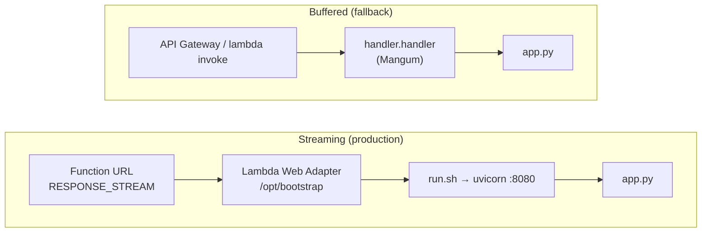

# Lambda Backend

`LambdaBackend/` is a FastAPI application that runs on AWS Lambda. It exposes
three endpoints (see [api_contract.md](api_contract.md)) and translates the
LangGraph agent's event stream into Server-Sent Events. The agent itself is
covered in [agents.md](agents.md), and security controls in
[security.md](security.md).

---

## 1. Module layout

```mermaid
flowchart TB
    run["run.sh<br/>(uvicorn, streaming)"] --> app
    handler["handler.py<br/>(Mangum, buffered)"] --> app
    app["app.py<br/>routes · CORS · SSE"] --> graph["orchestrator/graph.py"]
    app --> config["config.py<br/>Settings (lru_cache)"]
    graph --> nodes["orchestrator/nodes.py<br/>orchestrator · escalate · routing"]
    nodes --> prompts["orchestrator/prompts.py"]
    prompts --> spm[/"system_prompts.md"/]
    nodes --> tools["orchestrator/tools/"]
    tools --> rag_t["rag.py"] --> ragpkg["rag/<br/>embedder · index"]
    tools --> scr["scraper.py"]
    tools --> esc["escalation.py"]
    ragpkg --> npz[("rag_index.npz")]
    build["scripts/build_index.py"] --> loader["rag/loader.py"] --> pdfs[/"documents/*.pdf"/]
    build --> ragpkg
```

| File | Responsibility |
|---|---|
| `app.py` | FastAPI app, CORS middleware, Pydantic request models, SSE translation (`chat_events`), routes |
| `handler.py` | `handler = Mangum(app, lifespan="off")`: buffered Lambda entry point. **The name `handler.handler` must not change** |
| `run.sh` | `exec python -m uvicorn app:app --host 0.0.0.0 --port ${PORT:-8080} --no-access-log`: the entry point under the Lambda Web Adapter |
| `config.py` | The only module that reads `os.environ`. A frozen `Settings` dataclass, cached per container |
| `orchestrator/` | Graph, state, nodes, prompt parser, tools ([agents.md](agents.md)) |
| `rag/` | PDF chunking, embedding backends, the numpy vector index |
| `scripts/build_index.py` | Offline index build with a credential preflight |
| `scripts/package.sh` | Builds `cadre-lambda.zip` for the Lambda interpreter/platform |
| `system_prompts.md` | Prompt source of truth, bundled into the zip and parsed at runtime |

---

## 2. Two entry points

The Python Lambda runtime cannot use the Function URL's `RESPONSE_STREAM`
mode natively, and Mangum buffers the whole ASGI response. The backend
therefore ships two ways to run the same ASGI app:



| | Streaming | Buffered |
|---|---|---|
| Lambda handler | `run.sh` | `handler.handler` |
| Required layer | `LambdaAdapterLayerX86` (or `Arm64`) | none |
| Required env | `AWS_LAMBDA_EXEC_WRAPPER=/opt/bootstrap`, `AWS_LWA_INVOKE_MODE=response_stream`, `PORT=8080` | none |
| `/chat` behaviour | Tokens arrive progressively | Correct body, delivered all at once when the run finishes |
| Use | Production | Smoke tests, API Gateway, `aws lambda invoke` |

---

## 3. The SSE translation layer (`app.py`)

`chat_events()` is an async generator. It builds the initial graph state:

```python
{"messages": [*history_messages, HumanMessage(request.message)],
 "iterations": 0,
 "escalation_reason": None}
```

It then iterates `get_graph().astream_events(state, version="v2")` and maps
the LangGraph event kinds to SSE:

| LangGraph event | Condition | SSE emitted |
|---|---|---|
| `on_chat_model_stream` | chunk has text | `token {content}` |
| `on_tool_start` | — | `tool_start {tool, id}` |
| `on_tool_end` | — | `tool_end {tool, id, sources}`; sources appended to a run-wide list |
| `on_tool_error` | — | `tool_end {tool, id, sources: []}` (keeps the UI indicator from spinning forever) |
| `on_chain_end` | `name == "escalate"` | Each output message's content as `token` (the node produces no model tokens) |
| *(after loop)* | any sources collected | `sources {sources}` |
| *(after loop)* | no text was emitted | A fallback `token` with the booking link |
| *(exception)* | — | `error {message: "The agent hit an error. Please try again."}`, full traceback to the log |
| *(finally)* | always | `data: [DONE]` |

Helper details:

- `_chunk_text` handles both plain-string chunk content and content-block
  lists (`[{"type": "text", "text": …}]`), since providers differ.
- `_sources_from_output` reads the `artifact` off the `ToolMessage`, falls back
  to a `(content, artifact)` tuple, accepts a list or a `{"sources": [...]}`
  dict, and returns `[]` for anything else. An errored `ToolNode` result is a
  plain string, so this path must not assume a shape.
- `sse()` serialises with `ensure_ascii=False`, so non-ASCII text streams as
  UTF-8 rather than `\uXXXX` escapes.

### Streaming headers (do not remove)

```python
"Cache-Control": "no-cache",
"Connection": "keep-alive",
"X-Accel-Buffering": "no",
```

`X-Accel-Buffering: no` stops CloudFront, nginx or other intermediaries from
collecting the stream into one response. `test_streaming_headers_disable_proxy_buffering`
checks for both headers.

---

## 4. Request validation

Pydantic v2 models in `app.py` reject bad requests before the graph runs:

| Model | Field | Rule |
|---|---|---|
| `ChatRequest` | `message` | `min_length=1`, `max_length=4000` |
| | `history` | `max_length=40` items |
| `HistoryTurn` | `role` | `Literal["user", "assistant", "agent"]` |
| | `content` | `max_length=32000` |
| `FeedbackRequest` | `message_id` | alias `messageId` / `message_id` |
| | `rating` | `Literal["up", "down"]`, alias `rating` / `value` |
| | `content` | optional, alias `content` / `message_content` |

The worst-case input is roughly 4 000 + 40 × 32 000 ≈ 1.3 M characters. These
limits cap token cost and keep a request from overflowing the model's context.

---

## 5. Configuration (`config.py`)

`get_settings()` is `@lru_cache(maxsize=1)`, so settings resolve once per warm
container. Tests call `get_settings.cache_clear()`. `python-dotenv` loads
`LambdaBackend/.env` if it is installed and the file exists. In Lambda,
environment variables come from the function configuration.

Parsing is forgiving: `_int` and `_float` fall back to the default if a value
does not parse, rather than raising at import.

| Variable | Default | Used by |
|---|---|---|
| `OPENROUTER_API_KEY` | — (**required**) | `nodes.get_llm` (raises `RuntimeError` if empty) |
| `OPENROUTER_BASE_URL` | `https://openrouter.ai/api/v1` | LLM client |
| `MODEL_NAME` | `anthropic/claude-sonnet-4-6` | LLM client |
| `LLM_TEMPERATURE` | `0.2` | LLM client |
| `REQUEST_TIMEOUT` | `30` s | LLM client, scraper, embedder |
| `MAX_ITERATIONS` | `3` | Agent loop cap |
| `BOOKING_LINK` | `https://cadreai.com/book` | Prompts, escalation, fallback text |
| `CADRE_WEBSITE_URL` | `https://cadreai.com` | Scraper base, prompt placeholder |
| `PORTAL_LOGIN_URL` | `https://auth.gocadre.ai` | Prompt placeholder |
| `MATURITY_INDEX_URL` | `https://portal.gocadre.ai/ai-maturity-index` | Prompt placeholder |
| `SCRAPE_CACHE_TTL` | `3600` s | Scraper cache |
| `SCRAPE_MAX_CHARS` | `4000` | Scraper truncation |
| `EMBEDDING_BACKEND` | `hosted` | `hosted` \| `local` |
| `EMBEDDING_MODEL` | `openai/text-embedding-3-small` | Must equal the model recorded in the index |
| `EMBEDDINGS_BASE_URL` | `https://openrouter.ai/api/v1` | Hosted embedder |
| `EMBEDDINGS_API_KEY` | falls back to `OPENROUTER_API_KEY` **only if same host** | Hosted embedder |
| `INDEX_PATH` | `<LambdaBackend>/rag_index.npz` | Index load/save |
| `DOCUMENTS_DIR` | `<LambdaBackend>/documents` | Build-time only |
| `RAG_MIN_SCORE` | `0.35` | Cosine floor |
| `RAG_TOP_K` | `3` | Default hits per query |
| `CHUNK_SIZE` / `CHUNK_OVERLAP` | `500` / `50` chars | Build-time only |
| `CORS_ALLOW_ORIGIN` | `*` | CORS middleware. **Set to the site origin in production** |

Streaming-mode-only variables (`AWS_LAMBDA_EXEC_WRAPPER`,
`AWS_LWA_INVOKE_MODE`, `PORT`) are covered in [deployment.md](deployment.md).

---

## 6. Dependencies

### Runtime (`requirements.txt`, packaged into the zip)

| Package | Range | Purpose |
|---|---|---|
| `fastapi` | `>=0.115,<1.0` | HTTP framework, `StreamingResponse` |
| `uvicorn` | `>=0.32,<1.0` | ASGI server launched by `run.sh` |
| `mangum` | `>=0.19,<0.20` | ASGI→Lambda adapter for the buffered entry point |
| `langgraph` | `>=0.2.60,<0.7` | `StateGraph`, `ToolNode`, `add_messages` |
| `langchain-core` | `>=0.3.28,<0.4` | Messages, `@tool`, `astream_events` |
| `langchain-openai` | `>=0.2.14,<0.4` | `ChatOpenAI`, pointed at OpenRouter |
| `httpx` | `>=0.27,<0.29` | Async HTTP for the scraper and hosted embedder |
| `beautifulsoup4` | `>=4.12,<5.0` | HTML → text for the scraper |
| `pydantic` | `>=2.9,<3.0` | Request validation |
| `numpy` | `>=2.0,<3.0` | Vector index, cosine search |
| `pypdf` | `>=5.1,<7.0` | PDF text extraction (build-time; imported lazily) |
| `python-dotenv` | `>=1.0,<2.0` | `.env` loading in local development |

The runtime set deliberately **excludes torch and sentence-transformers**.
PyTorch alone exceeds Lambda's 250 MB unzipped limit. The current package is
about 32 MB zipped and 124 MB unzipped.

Versions are given as ranges rather than exact pins because `package.sh`
resolves them for the Lambda interpreter (`--python-version 3.13 --platform
manylinux…`), not for the local one. **Trade-off:** builds are not
byte-reproducible. See [decisions.md](decisions.md).

### Development (`requirements-dev.txt`, never packaged)

| Package | Purpose |
|---|---|
| `sentence-transformers` | `EMBEDDING_BACKEND=local` for offline builds and tests |
| `pytest`, `pytest-asyncio` | Test runner (`asyncio_mode = auto`) |
| `respx` | Mocks `httpx` in the scraper and embedder tests |

### External APIs

| API | Endpoint | Auth | Called from |
|---|---|---|---|
| OpenRouter chat completions | `POST {OPENROUTER_BASE_URL}/chat/completions` (via `ChatOpenAI`, streaming) | `Bearer OPENROUTER_API_KEY` | `nodes.orchestrator` |
| OpenRouter embeddings (OpenAI-compatible) | `POST {EMBEDDINGS_BASE_URL}/embeddings`, batches of 96 | `Bearer EMBEDDINGS_API_KEY` | `rag.embedder.HostedEmbedder` |
| Cadre website | `GET {CADRE_WEBSITE_URL}{allowlisted path}` | none, `User-Agent: CadreAI-Chatbot/1.0` | `tools.scraper` |

OpenRouter also receives `HTTP-Referer: https://cadreai.com` and
`X-Title: Cadre AI Chatbot` for traffic attribution.

---

## 7. Per-container caching and cold start

Every expensive object is created once per Lambda execution environment and
reused across warm invocations:

| Object | Mechanism | Loaded |
|---|---|---|
| `Settings` | `@lru_cache` | First access |
| Compiled graph | `@lru_cache` on `get_graph()` | First `/chat` |
| LLM client with tools bound | `@lru_cache` on `get_llm()` | First orchestrator call |
| Prompt text, tool descriptions, escalation table | `@lru_cache` in `prompts.py` | **Import time** (the tool decorators read descriptions) |
| Vector index + embedder | module globals in `tools/rag.py` | First `query_knowledge_base` call |
| Scraped pages | dict with monotonic-clock TTL | Per page, per TTL |

Cold start consists of importing FastAPI/LangChain and parsing
`system_prompts.md`. The index loads on the first KB query with `np.load`, not
at cold start. No model weights are loaded at any point.

---

## 8. Error-handling strategy

The design rule: **tools do not raise, and the stream does not die silently.**

| Layer | Failure | Handling |
|---|---|---|
| Prompt parser | Missing heading, fence or reason code | `PromptError` **at import**, so the deploy fails loudly instead of shipping an empty prompt |
| Config | Unparseable number | Silent fallback to the default |
| `get_llm` | No API key | `RuntimeError` → caught by `chat_events` → `error` event |
| LLM call | Timeout / 5xx | `ChatOpenAI(max_retries=1, timeout=REQUEST_TIMEOUT)`, then `error` event |
| `query_knowledge_base` | Missing or corrupt index, model mismatch, embedding failure | Caught broadly; returned as **text for the model** ("knowledge base is unavailable … try scrape_cadre_website"), logged at WARNING |
| `scrape_cadre_website` | HTTP status, network error, parse error, empty page | Returned as text telling the model to escalate; failures are **not cached** |
| Any tool | Unexpected raise | `ToolNode(handle_tool_errors=True)` turns it into a `ToolMessage`; `on_tool_error` still yields `tool_end` |
| Graph | Produces no text | Fallback token with the booking link |
| Graph | Any exception | `logger.exception` + `error` event + `[DONE]` |
| Embedder | 401/403/404/429 | `EmbeddingError` with an actionable hint (`_status_hint`) |
| Embedder | Placeholder key, OpenRouter key pointed at another host | Rejected at construction with an explanation |

---

## 9. Logging

The standard library `logging` is configured at `INFO` and goes to CloudWatch
through Lambda's stdout. uvicorn runs with `--no-access-log`.

| Logger | Level | Event |
|---|---|---|
| `cadre.chat` | INFO | `feedback {json}`: one line per rating, queryable with Logs Insights |
| `cadre.chat` | WARNING | `graph produced no text output` |
| `cadre.chat` | ERROR | `chat stream failed` + traceback |
| `orchestrator.nodes` | INFO | `escalating: reason=<code>`, iteration-cap notices |
| `orchestrator.tools.rag` | INFO/WARNING | Index loaded (chunk count, model); query failures |
| `orchestrator.tools.scraper` | WARNING | Non-2xx, network or parse failures |

User messages and model answers are **not** logged, except the answer text
that comes with a feedback rating. See [security.md](security.md#6-data-handling-and-privacy).

Example Logs Insights query:

```
fields @timestamp, @message
| filter @message like /feedback/
| parse @message 'feedback *' as payload
| stats count(*) by jsonparse(payload).rating
```

---

## 10. Testing

`pytest` from `LambdaBackend/`. There are 121 tests (111 test functions, some parametrised); they run in a few
seconds and need **no network and no API keys**.

| File | Tests | Covers |
|---|---|---|
| `test_app.py` | 23 | Health, feedback aliases, request size limits, SSE framing, tool events, escalate streaming, empty-run fallback, exception → `error` + `[DONE]`, streaming headers |
| `test_graph.py` | 19 | Every routing branch, iteration cap, parallel tool results, escalate fallback, full scripted runs |
| `test_tools.py` | 22 | KB hits/threshold/top_k/degradation, scraper cleaning/cache/TTL/errors, allowlist ↔ prompt parity, escalation templates |
| `test_rag.py` | 32 | Chunker invariants, normalisation, index round-trip, model and dimension mismatch, hosted embedder errors, key-fallback host scoping |
| `test_prompts.py` | 15 | Prompt parsing, placeholder substitution, strict failures |

Test doubles: a keyword-based `StubEmbedder` and a stub index
(`conftest.py`), `respx` for all HTTP, and a scripted chat model in
`test_graph.py` that returns predetermined tool calls and answers.
`conftest.py` also clears the environment and the tool caches between tests.

---

## 11. Local development

```bash
cd LambdaBackend
python -m venv .venv && source .venv/bin/activate
pip install -r requirements-dev.txt
cp .env.example .env
python scripts/build_index.py            # hosted embeddings (default)
uvicorn app:app --reload --port 8000

curl -N -X POST http://localhost:8000/chat \
  -H 'content-type: application/json' \
  -d '{"message":"What industries does Cadre work with?","history":[]}'
```

If streaming works, `tool_start` arrives first and tokens then arrive with
visible gaps between them.
