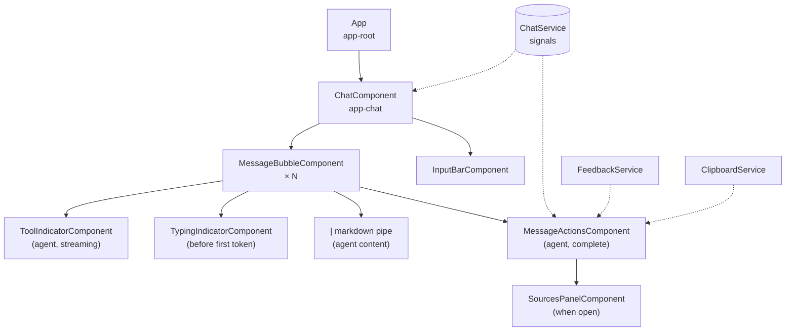
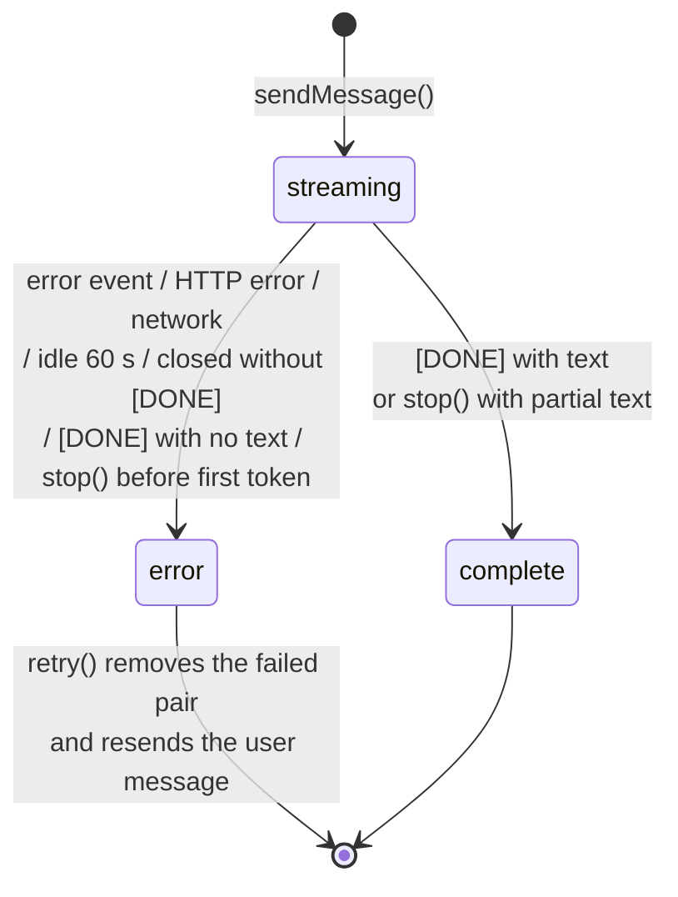
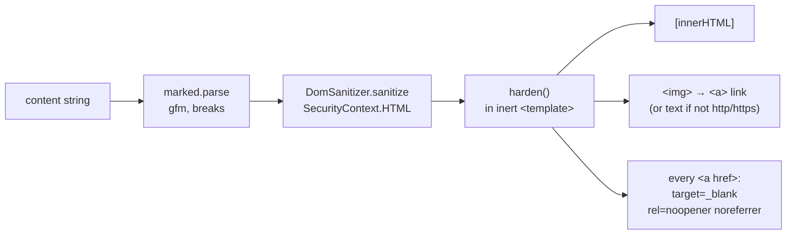

# Web UI

`WebUI/` is an Angular 20 single-page app. It has one screen, a chat, and it
streams replies from the backend over `fetch` + `ReadableStream`. It is built
to static files and served from S3 behind CloudFront. The wire format is in
[api_contract.md](api_contract.md), and the browser security controls are in
[security.md](security.md#3-frontend-controls).

---

## 1. Stack

| Concern | Choice |
|---|---|
| Framework | Angular `^20.3`, standalone components only (no NgModules) |
| Change detection | `provideZonelessChangeDetection()` + `OnPush` everywhere; state in signals |
| HTTP | `fetch` for the SSE stream; `HttpClient` (`withFetch()`) for `/feedback` |
| Markdown | `marked` `^18` → Angular `DomSanitizer` → DOM hardening pass |
| Icons | `@lucide/angular`, imported per icon (tree-shaken) |
| Styling | Hand-written SCSS with CSS custom-property tokens; no UI library |
| Font | Inter 400/600 from Google Fonts |
| Build | `@angular/build:application` (esbuild) |
| Tests | Karma + Jasmine (`ng test`, `npm run test:ci` headless Chrome) |
| Lint | ESLint 9 flat config, `angular-eslint` 20, `typescript-eslint` recommended + stylistic, template accessibility rules |
| TypeScript | `~5.9`, `strict`, `strictTemplates`, `noImplicitReturns`, `noPropertyAccessFromIndexSignature` |

### Runtime dependencies

| Package | Why |
|---|---|
| `@angular/core`, `common`, `compiler`, `platform-browser`, `forms`, `router` | Framework |
| `@lucide/angular` | SVG icons as standalone directives |
| `marked` | GFM markdown → HTML for agent answers |
| `rxjs` | `HttpClient` observables (feedback only) |
| `tslib`, `zone.js` | Angular peer dependencies (`zone.js` is installed but zoneless mode does not use it; `polyfills: []`) |

---

## 2. Structure

```
src/
├── main.ts                    bootstrapApplication(App, appConfig)
├── index.html                 CSP <meta>, fonts, <app-root>
├── styles.scss                → styles/_tokens, _typography, global
├── environments/
│   ├── environment.ts         apiUrl: ''              (dev, proxied)
│   └── environment.prod.ts    apiUrl: Function URL    (swapped in by fileReplacements)
└── app/
    ├── app.config.ts          zoneless, global error listeners, HttpClient(fetch)
    ├── app.ts                 <app-chat />
    ├── core/
    │   ├── services/
    │   │   ├── chat.service.ts        conversation state + streaming client
    │   │   ├── sse.ts                 incremental SSE decoder
    │   │   ├── feedback.service.ts    POST /feedback
    │   │   └── clipboard.service.ts   navigator.clipboard wrapper
    │   └── pipes/markdown.pipe.ts     markdown → sanitized, hardened HTML
    └── features/chat/
        ├── chat.component.*           page shell, scroll management, empty state
        ├── models/                    message, source, feedback types + helpers
        └── components/
            ├── input-bar/             auto-growing composer, send/stop
            ├── message-bubble/        one turn: text/markdown, error + retry
            ├── message-actions/       rate, copy, sources toggle
            ├── sources-panel/         inline citation list with expandable excerpts
            ├── tool-indicator/        "Searching knowledge base…" etc.
            └── typing-indicator/      dots before the first token
```

### Component tree



---

## 3. State model

All conversation state is in `ChatService`, a root singleton, as one
`signal<Message[]>`. Components read it through derived signals. There is no
store library, no router state and no persistence: reloading the page clears
the conversation.

```ts
interface Message {
  id: string;                 // crypto.randomUUID()
  role: 'user' | 'agent';
  content: string;            // accumulates while streaming
  status: 'streaming' | 'complete' | 'error';
  timestamp: Date;
  toolEvents: ToolEvent[];    // { id, tool, status: 'running'|'done', sources }
  feedback: 'up' | 'down' | null;
  error?: string;
}
```

Derived signals: `isStreaming` (any message streaming), `isEmpty`, and per
component `computed()` values (`messageSources`, `ratingLocked`, …).
Updates are immutable: `patch(id, fn)` maps over the array.

### Message lifecycle



---

## 4. Streaming client (`chat.service.ts` + `sse.ts`)

`EventSource` cannot send a POST body, so the client streams with `fetch`:

1. **Send.** `sendMessage` trims the text, ignores it if a reply is already
   streaming, captures the history **before** appending anything, then
   appends the user message and an empty `streaming` agent message.
2. **Request.** `POST /chat` with `Accept: text/event-stream` and an
   `AbortController`. Any earlier in-flight request is aborted.
3. **Idle watchdog.** Armed before the `fetch` and re-armed on every chunk.
   After 60 s of silence the request is aborted with a `StreamTimeoutError`.
   Tool events keep the timer alive, so a slow answer is not killed; only a
   stalled connection is.
4. **Decode.** `TextDecoder(stream: true)` handles multi-byte characters
   split across chunks. `SseDecoder.push` normalises CRLF, buffers until a
   blank line, then parses `event:` and multi-line `data:` fields and ignores
   `:` comments.
5. **Dispatch.** `handleEvent` switches on the event type (see the contract).
   Payload readers accept several key names, so the client tolerates small
   backend changes.
6. **Finish.** On `[DONE]` or `error` the reader is cancelled right away
   instead of waiting for the server to close the socket. If the stream ends
   without `[DONE]`, the connection was cut, and the client reports an error.

### Token batching

Writing each token straight into the signal would re-parse the whole answer
and rebuild its DOM once per token. Instead, tokens accumulate in
`pendingTokens` and are flushed once per `requestAnimationFrame`. `finish`,
`stop` and `markError` flush first, so no received text is lost.

### History trimming

`getHistory()` sends at most **20 turns / 24 000 characters**, taken as a
contiguous recent tail. It drops unanswered questions and starts on a user
turn. These limits sit below the backend's (40 turns, 32 000 characters per
turn), so a trimmed history is never rejected.

### Stop, retry, new chat

| Action | Effect |
|---|---|
| `stop()` | Flush tokens, abort. With partial text, the message is marked `complete`; with none, it becomes an `error` ("Response stopped.") |
| `retry()` | Only for the **last** message when it is an error. Removes the failed agent turn and its user turn, then calls `sendMessage` with the same text |
| `clear()` | Abort, discard buffered tokens, empty the list |

Aborts started by `stop`, `clear` or a newer request are recognised through
`controller.signal.aborted`. They do not turn into errors, because the action
that aborted already owns the UI state.

---

## 5. Rendering agent markdown (`markdown.pipe.ts`)



- The pipe is **pure**, so it only re-runs when the content string changes,
  which with batching is at most once per frame.
- User messages are **never** run through markdown. They are rendered as
  interpolated text (`{{ }}`), which is escaped automatically.
- The reasons for the hardening pass are in [security.md](security.md#3-frontend-controls).

---

## 6. Components

| Component | Inputs / outputs | Notable behaviour |
|---|---|---|
| `ChatComponent` | — | Sticky auto-scroll: follows new content only when the user is within 80 px of the bottom, via `afterRenderEffect` so `scrollHeight` is up to date. Sending, retrying or starting a new chat re-enables it. Empty state has three suggested prompts. Header status is an `aria-live` region |
| `InputBarComponent` | `placeholder`, `streaming` → `send`, `stop` | Enter sends, Shift+Enter adds a newline, IME composition is ignored. Grows up to 4 rows. `maxlength=4000` with a counter shown within 400 characters of the limit. The textarea stays editable while a reply streams. Auto-focuses after each reply except on touch devices, when focus is elsewhere, or when the user has text selected |
| `MessageBubbleComponent` | `message`, `canRetry` → `retry` | User turn: plain text on a dark bubble, right-aligned. Agent turn: markdown. Shows a tool indicator while streaming, dots until the first token, and an error block with **Try again** only on the latest turn |
| `MessageActionsComponent` | `message` | Thumbs up/down: optimistic, one rating per message, reverted on failure. Copy with a 2 s confirmation. Sources toggle with a count; closes on outside click or Escape |
| `SourcesPanelComponent` | `sources` → `closed` | Inline (not a modal). URL sources show a link and the domain; document sources show the label and an excerpt clamped to 3 lines. **Show more** appears only when the excerpt is actually clipped, measured once in `afterNextRender` |
| `ToolIndicatorComponent` | `events` | Shows the currently running tool with an icon and label; hidden once all tools are done |
| `TypingIndicatorComponent` | — | Three animated dots; the animation is disabled under `prefers-reduced-motion` |

Sources for a message are the de-duplicated union of every tool event's
sources (`messageSources` → `dedupeSources`). URLs are keyed on the lowercased
URL; documents are keyed on normalised excerpt text.

---

## 7. Styling

- `src/styles/_tokens.scss` defines CSS custom properties for colour
  (matched to cadreai.com: cream `#f2efe9` background, near-black text,
  coral accent `#c0392b`), spacing scale `--s-1…7`, radii, soft shadows,
  layout sizes (`--content-max-width: 760px`) and motion. The motion tokens
  collapse under `prefers-reduced-motion`.
- There is one theme and no dark mode, on purpose: the widget is meant to
  look like part of the Cadre site.
- Component styles are scoped per component. Production budgets are 8 kB
  warning / 12 kB error per component stylesheet, and 500 kB / 1 MB for the
  initial bundle.
- BEM-style class names (`chat__header`, `composer__send`, `source__excerpt--clamped`).

---

## 8. Accessibility

- `angular-eslint`'s template accessibility rules run in `ng lint`.
- Icon-only buttons have `aria-label`s. Toggle buttons set `aria-pressed`
  and `aria-expanded`.
- Live regions: header status (`aria-live="polite"`), tool indicator
  (`role="status"`), character counter, and errors (`role="alert"`).
- Decorative SVGs are `aria-hidden`. The sources panel is a labelled
  `role="group"` that closes on Escape.
- Reduced-motion preferences are respected.

---

## 9. Build, run, test

```bash
cd WebUI
npm ci
npx ng serve                          # dev, :4200, proxies /chat and /feedback → :8000
node tools/mock-server.mjs            # optional: fake backend on :8000
npx ng build                          # production (default configuration) → dist/webui/browser/
npm test                              # Karma, watch mode
npm run test:ci                       # single headless run
npm run lint
```

Production configuration (`angular.json`):

| Setting | Value | Why |
|---|---|---|
| `fileReplacements` | `environment.ts` → `environment.prod.ts` | Injects the Function URL |
| `outputHashing` | `all` | Cache-busting file names; long cache TTLs are safe |
| `optimization.styles.inlineCritical` | `false` | With critical-CSS inlining on, the stylesheet loads through an inline `onload` handler, which `script-src 'self'` blocks |
| `budgets` | see §7 | Size regression guard |

### Unit tests (7 spec files)

| Spec | Covers |
|---|---|
| `chat.service.spec.ts` | Streaming into a completed message, `done`/`[DONE]`, tool lifecycle and source shapes, history trimming, stop/retry/clear, HTTP/network error mapping, 60 s watchdog, missing `[DONE]` |
| `sse.spec.ts` | Records split across chunks, CRLF, multi-line data, comments, flush |
| `markdown.pipe.spec.ts` | Sanitising, image → link conversion, link hardening |
| `source.model.spec.ts` | De-duplication keys, domain extraction |
| `input-bar.component.spec.ts` | Enter/Shift+Enter, IME, limits, send/stop swap |
| `message-bubble.component.spec.ts` | Role rendering, error + retry visibility |
| `sources-panel.component.spec.ts` | Excerpt clamping and Show more |

---

## 10. Known limitations

- **The API URL is fixed at build time** in two places,
  `environment.prod.ts` and the CSP `connect-src` in `index.html`. Moving the
  backend means changing both and rebuilding.
- **No persistence.** A reload loses the conversation. This is by design; see
  [decisions.md](decisions.md).
- **Feedback is not idempotent.** Two tabs could each rate the same message.
- **No end-to-end tests.** Only unit tests run; `ng e2e` has no framework
  configured.
